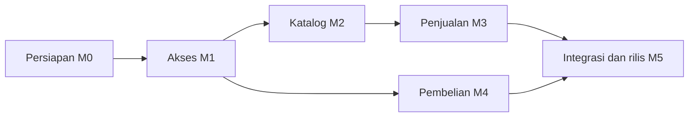

# Rencana Pelaksanaan Backend LarisSama

Status: rencana pelaksanaan yang diperbarui 2026-10-06. D06 kini menambah tiga operationId penjualan (koreksi, pembatalan, retur); target menjadi 33 handler. Implementasi D06 dan gate integrasi/conformance/handoff berjalan. Seluruh operasi tetap DRAFT sampai bukti dan handoff per operationId terpenuhi. Backend Laravel menjadi tanggung jawab repo ini; AI/pengembang frontend menerima kontrak dan contoh integrasi yang jelas.

## Dokumen yang dipakai

| Dokumen | Otoritas / kegunaan |
| --- | --- |
| [AGENTS.md](AGENTS.md), [aturan database](database/AGENTS.md) | Instruksi kerja backend dan migration. |
| [database/README.md](database/README.md) | Rancangan logis delapan tabel; migration kelak menunjukkan schema yang benar-benar diterapkan. |
| [DESIGN.md](docs/backend/DESIGN.md) | Modul, struktur Laravel, batas transaksi, tenant, perhitungan, dan invariant. |
| [DECISIONS.md](docs/backend/DECISIONS.md) | Kebutuhan K01–K09 serta keputusan D01–D16, termasuk pilihan yang masih terbuka. |
| [openapi.yaml](docs/api/openapi.yaml) | Bentuk wire API kandidat, parameter, schema, contoh, status, dan keputusan pemblokir per operasi. |
| [panduan API](docs/api/README.md) | Petunjuk AI frontend, alur integrasi, null/decimal/errors, dan changelog kontrak. |
| [TEST_PLAN.md](docs/backend/TEST_PLAN.md) | Skenario, fixture sintetis, expected result, gate, dan format pencatatan test. |
| [IMPLEMENTATION_PROGRESS.md](IMPLEMENTATION_PROGRESS.md) | 29 task, dependency, acceptance, status aktual, commit, run test, dan handoff. |
| [DEVELOPMENT_WORKFLOW.md](DEVELOPMENT_WORKFLOW.md) | Proses kerja per slice dan aturan commit berdasarkan kelompok perubahan terkait. |

Jangan menduplikasi status pelaksanaan dalam dokumen desain. Tracker adalah catatan progres; keputusan berada di register; payload berada di OpenAPI. Jika salah satu berubah, perbarui artefak terkait secara eksplisit dan commit file yang saling terkait sebagai satu kelompok.

## Scope dan hasil yang dituju

- Banyak warung dengan data terisolasi; konteks tenant berasal dari user login. User/warung aktif dan masa berlaku diperiksa backend.
- Master kategori serta menu dan harga jual.
- Penjualan: satu header, minimal satu rincian, snapshot nama/harga, perhitungan backend, riwayat dan pendapatan periode.
- Pembelian bahan: header-rincian, mendukung input lengkap maupun satu baris seperti “Belanja di pasar” dan nominal. Total pembelian periode berdiri sendiri dari penjualan.
- API yang terdokumentasi untuk akses, administrasi, katalog, penjualan, pembelian dan laporan; test membuktikan izin, angka, integritas, serta kontrak.

Aplikasi tidak memerlukan workflow dapur, resep, stok, item penjualan bebas, atau perhitungan HPP/laba. D07 telah diputuskan: semua baris penjualan memilih menu terdaftar, sedangkan pembelian tidak ditautkan ke menu. Field schema lama seperti `harga_modal` dan role `koki` tidak membuat fitur biaya/dapur; bila dipakai perlu keputusan dan kontrak tersendiri.

## Milestone dan gate

| Milestone | Task | Hasil yang harus tersedia | Kriteria gate |
| --- | --- | --- | --- |
| M0 — Kesiapan dan kontrak | BE-001–004 | Runtime dan DB test; inventaris migration; keputusan awal; konvensi/API draft ditinjau; validator dan harness tersedia. | G0: runtime/harness aman, keputusan prasyarat tersedia, lint kontrak lulus. |
| M1 — Akses dan administrasi | BE-101–105 | Warung/users, login/me/logout, tenant/policy/status aktif, admin warung+owner, pengelolaan user tenant. 12 operasi akses/admin. | G1: auth, role, tenant, provisioning, dan kontrak lulus; operasi terkait siap frontend. |
| M2 — Kategori dan menu | BE-201–204 | Migration/model/API katalog, filter/pagination, harga decimal, kategori satu warung. 8 operasi katalog. | G2: katalog dan arsip sesuai aturan; data tenant lain tidak terbaca/terubah; strategi D16 dipilih; kontrak lulus. |
| M3 — Penjualan dan pendapatan | BE-301–306 | Create/list/detail, koreksi/pembatalan beralasan dalam 72 jam, retur penuh/sebagian append-only setelahnya, pembayaran, retry, audit, dan laporan bersih. | G3: nominal/snapshot/rollback/retry/concurrency/window edit/retur/laporan lulus pada engine target; kontrak siap. |
| M4 — Pembelian dan total periode | BE-401–406 | Action atomic ringkas/rinci, nomor/retry, riwayat/detail, koreksi dengan alasan dan snapshot, serta laporan pembelian. 5 operasi transaksi dan 1 laporan. | G4: “Belanja di pasar + nominal” diterima, total detail benar, koreksi/pembatalan menjaga audit, tenant/rollback/retry/laporan lulus. |
| M5 — Integrasi dan rilis | BE-501–504 | Regression, runbook deploy/recovery, environment integrasi, handoff frontend dan bukti penerimaan. | G5: seluruh test wajib lulus, tidak ada endpoint diserahkan tanpa kontrak, runbook dan handoff terbukti. |

Dependency teknis:

Urutan kerja default mengikuti M0 sampai M5. Pembelian tetap tidak memiliki relasi domain ke penjualan; dependency M4 adalah akses/tenant M1. Detail dependency setiap task ada di tracker, termasuk keputusan retry sebelum action dibuat dan pembuktian concurrency sesudahnya.

## Keputusan yang ditutup sebelum coding terkait

1. M0/M1: D01 engine/transisi data, D02 auth, D03 tanggal nullable, D04 role/superadmin, D12 identitas/email, D13 HTTP; bagian D08 yang diperlukan untuk tanggal masa aktif.
2. M2: baseline decimal D05 sudah dipilih; arsip active-only D06 diterapkan. FK gabungan tenant D16 telah dipilih dan diterapkan. D14 hanya bila media gambar menu masuk scope.
3. M3: D05/D06 sekarang diputuskan; implementasikan koreksi/cancel maksimal 72 jam dari `created_at` UTC, retur nominal penuh/sebagian dengan alasan, ledger audit append-only, dan pengurangan retur pada periode retur. Gunakan timezone periode D08 serta replay durable D09. Setiap item wajib dari menu sesuai D07.
4. M4: terapkan baseline decimal D05, timezone D08, replay D09, dan finalisasi input sebagian D10 serta koreksi pembelian D11.

Pilihan yang masih PROPOSED/OPEN tetap memerlukan keputusan sebelum task yang bergantung padanya. Pilihan MySQL 8.0.40, auth, baseline nominal, Idempotency-Key, dan FK tenant gabungan sudah dicatat; rincian tersisa tetap menjadi gate sebelum kontrak siap frontend. Pekerjaan yang tidak bergantung pada pilihan itu dapat diteruskan.

## Urutan kerja satu task

1. Baca aturan, task/dependency, keputusan, status Git, dan contract operationId yang terkait.
2. Catat tujuan, sumber aturan, fakta yang dibaca/diubah, invariant, auth/tenant, transaksi/retry, file, API, acceptance, dan test yang akan membuktikannya.
3. Tetapkan keputusan yang memblokir. Perbarui schema/kontrak kandidat lebih dulu bila diperlukan; belum menandai READY.
4. Implementasikan slice: migration aman → model/validasi/policy → action/query → controller/resource. Baca flow Laravel aktual sebelum mengubah bootstrap/route atau package.
5. Setelah mengedit kelompok file terkait, review diff lengkap, stage path yang termasuk task, jalankan `git diff --cached --check`, commit kelompok itu, lalu catat hash. Commit checkpoint boleh belum memenuhi gate slice.
6. Jalankan test penting untuk perubahan, lalu suite yang relevan setelah komponennya lengkap. Rekam commit yang diuji dan hasil; skipped/not-run tidak menjadi pass.
7. Cocokkan respons runtime dengan OpenAPI, contoh sukses/error dan dokumentasi. Commit perubahan kontrak dan dokumentasi bersama file terkait dalam kelompok perubahan yang sama.
8. Penuhi gate, ubah status task berdasarkan bukti, lalu serahkan operasi yang siap dengan versi spec, environment, auth, dan run test.

## Kriteria selesai

Task DONE membutuhkan deliverable dan acceptance pada tracker, keputusan yang diperlukan, invariant teruji, dokumentasi sesuai perilaku, dan bukti commit/test. Milestone hanya lulus jika seluruh skenario wajib pada TEST_PLAN lulus dan gap/defer dicatat dengan sumber persetujuan. Tidak menggunakan persentase kode coverage sebagai satu-satunya syarat.

Contoh hasil yang akan dibuktikan: pendapatan `33000.00` dari sale fixture sebelum retur; transaksi retur mengurangi pendapatan pada periode ketika retur dicatat. Pembelian ringkas `150000.00` ditambah pembelian rinci `95000.00` menjadi `245000.00`. Laporan tidak menggandakan header akibat join rincian dan tidak memasukkan warung lain.

## Serah-terima kepada AI frontend

AI frontend mulai dari docs/api/README.md, memeriksa operationId di OpenAPI, lalu status handoff tracker. Setiap operasi READY_FOR_FRONTEND memiliki:

- versi/commit kontrak dan implementasi yang diuji;
- base URL environment, auth final, role/scope;
- request/response sukses serta contoh error per field;
- format decimal, ID, tanggal, null, pagination, dan arti summary;
- perilaku retry/correction jika fitur itu diserahkan;
- run test yang mendukung dan keterbatasan yang masih berlaku.

Semua operasi tetap DRAFT untuk integrasi live sampai slice masing-masing lulus. Frontend dapat membangun UI/model/adapter menggunakan schema OpenAPI dan mock untuk operasi yang implementasinya sudah DONE; endpoint koreksi/retur menunggu D06 implementation/conformance. Belum ada endpoint baru yang diserahkan untuk integrasi live. Lanjutkan dependency yang masih terbuka pada tracker; status READY hanya diberikan setelah implementasi, verifikasi yang diwajibkan, dan handoff slice terpenuhi.
