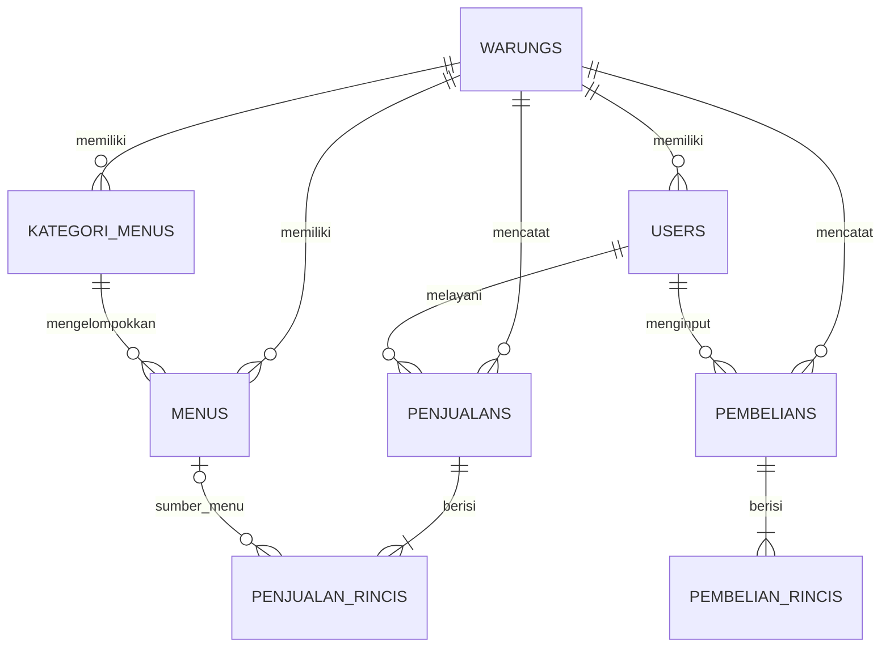

# Rencana Database LarisSama

## Status dokumen

Dokumen ini adalah rancangan logis yang dipindahkan dari `database.md` di folder Downloads. Delapan tabel bisnis inti, termasuk adaptasi `users`, timezone, katalog, FK tenant gabungan, dan empat tabel transaksi, telah diterapkan serta diperiksa pada database development lokal MySQL 8.0.40. Tiga tabel audit tambahan mencatat koreksi pembelian, koreksi penjualan, dan retur penjualan. Migration `users` menolak database lama yang sudah berisi user sampai pemetaan identitas dan tenant ditetapkan; data produksi tidak disentuh. Setelah migration diterapkan, migration Laravel menjadi sumber kebenaran untuk struktur fisik database; perbarui dokumen ini bila keputusan skema berubah.

## Batas otoritas

- Dokumen ini menjelaskan rancangan logis dan keputusan yang masih terbuka.
- Migration Laravel adalah sumber kebenaran untuk struktur fisik yang benar-benar berjalan.
- Kode backend adalah sumber kebenaran untuk validasi, otorisasi, dan transisi bisnis.
- Kontrak API menentukan bentuk data yang dikonsumsi frontend; frontend tidak menjadi sumber kebenaran bisnis.
- Jika sumber-sumber itu berbeda, telusuri keputusan yang mendasarinya dan perbarui artefak yang terkait. Jangan menyelesaikan konflik dengan menebak atau hanya mengubah dokumen turunan.

Rancangan ini mencakup delapan tabel bisnis: `warungs`, `users`, `kategori_menus`, `menus`, `penjualans`, `penjualan_rincis`, `pembelians`, dan `pembelian_rincis`. Tabel infrastruktur framework, termasuk `sessions`, `cache`, `jobs`, `password_reset_tokens`, dan Sanctum `personal_access_tokens`, berada di luar hitungan tersebut. Aplikasi tidak memakai tabel `mejas` atau `menu_varians`.

Skema audit memperluasnya menjadi sebelas tabel bisnis fisik: `pembelian_koreksis`, `penjualan_koreksis`, dan `penjualan_returs` menyimpan perubahan/pengembalian transaksi sebagai riwayat terpisah.

## Aturan inti

- Satu aplikasi mengelola banyak warung.
- Satu warung dapat memiliki banyak user; setiap user biasa terhubung ke tepat satu warung.
- `users.warung_id` boleh `NULL` hanya untuk `superadmin`.
- Warung memiliki status aktif dan rentang masa aktif.
- Aplikasi dan sesi koneksi MySQL memakai UTC. Timestamp disimpan/dikirim UTC; tampilan dan filter periode mengikuti timezone lokal warung. Kolom IANA `warungs.timezone` nullable tanpa default; sementara ini tenant tanpa timezone belum boleh login. Pengelola wajib mengisi timezone saat provisioning. Factory uji memakai `Asia/Jakarta` sebagai contoh sintetis.
- Kategori menu dan menu milik satu warung.
- Satu penjualan memiliki satu kasir dan banyak rincian.
- Rincian penjualan menyimpan snapshot nama dan harga supaya perubahan data menu tidak mengubah riwayat transaksi.
- Setiap rincian penjualan wajib merujuk ke menu pada warung yang sama; nama dan harga jual disimpan sebagai snapshot.
- Satu pembelian dicatat untuk satu warung dan satu user pencatat, lalu memiliki satu atau lebih rincian.
- Rincian pembelian boleh berupa item bahan satu per satu atau satu baris ringkasan, misalnya `Belanja di pasar` dengan nominal total.
- Pembelian dan penjualan berdiri sendiri. Pembelian tidak mengubah stok dan tidak terhubung ke menu, resep, atau rincian penjualan.
- Total pembelian pada header sama dengan penjumlahan `subtotal` seluruh rincian dan dihitung backend.

## Relasi



## Tabel dan kolom

Tipe berikut menjelaskan maksud desain. Migration harus memakai tipe Laravel yang sesuai dengan database target, menjaga presisi angka, serta membuat foreign key dan index yang diperlukan.

### `warungs`

| Kolom | Tipe/rule |
| --- | --- |
| `id` | BIGINT primary key |
| `kode` | VARCHAR(30), unique global; dibuat otomatis oleh backend saat provisioning warung |
| `nama` | VARCHAR(150) |
| `alamat` | TEXT, nullable |
| `telepon` | VARCHAR(30), nullable |
| `logo` | VARCHAR(255), nullable |
| `timezone` | VARCHAR(64), identifier IANA, nullable tanpa default; wajib diisi sebelum akses tenant diaktifkan |
| `tanggal_mulai` | DATE, nullable pada rancangan |
| `tanggal_berakhir` | DATE, nullable pada rancangan |
| `aktif` | BOOLEAN, default true |
| `pendaftaran_disetujui` | BOOLEAN, default true untuk menjaga data lama; pendaftaran publik dimulai false dan hanya admin platform dapat menyetujuinya |
| `created_at`, `updated_at` | timestamp |

### `users`

| Kolom | Tipe/rule |
| --- | --- |
| `id` | BIGINT primary key |
| `warung_id` | BIGINT foreign key, nullable hanya untuk superadmin |
| `nama` | VARCHAR(150) |
| `username` | VARCHAR(100), unique global sesuai rancangan |
| `email` | VARCHAR(150), nullable; unique global jika diisi |
| `password` | VARCHAR(255), simpan hash melalui mekanisme Laravel |
| `role` | VARCHAR(30); contoh: `superadmin`, `owner`, `manager`, `kasir`, `koki` |
| `aktif` | BOOLEAN, default true |
| `created_at`, `updated_at` | timestamp |

Relasi: satu warung memiliki banyak user. Validasi aplikasi harus memastikan user tanpa warung benar-benar ber-role `superadmin` dan user dengan role lain memiliki warung.

### `kategori_menus`

| Kolom | Tipe/rule |
| --- | --- |
| `id` | BIGINT primary key |
| `warung_id` | BIGINT foreign key; unique key `(warung_id, id)` mendukung FK tenant |
| `nama` | VARCHAR(100) |
| `urutan` | INT, default 0 |
| `aktif` | BOOLEAN, default true |
| `created_at`, `updated_at` | timestamp |

### `menus`

| Kolom | Tipe/rule |
| --- | --- |
| `id` | BIGINT primary key |
| `warung_id` | BIGINT foreign key; unique key `(warung_id, id)` mendukung FK tenant |
| `kategori_menu_id` | BIGINT bagian FK gabungan dengan `warung_id` |
| `kode` | VARCHAR(30), unique bersama `warung_id`; dibuat otomatis backend saat menu dibuat |
| `nama` | VARCHAR(150) |
| `harga` | DECIMAL(15,2) |
| `harga_modal` | DECIMAL(15,2), nullable |
| `gambar` | VARCHAR(255), nullable |
| `deskripsi` | TEXT, nullable |
| `aktif` | BOOLEAN, default true |
| `created_at`, `updated_at` | timestamp |

Kategori dan menu harus berasal dari warung yang sama.

Migration maju `2026_10_04_085007_add_tenant_composite_foreign_keys` menambahkan unique key `(warung_id, id)` pada `users`, `kategori_menus`, dan `menus`, lalu menetapkan FK `(warung_id, kategori_menu_id)` → `kategori_menus.(warung_id, id)`. Database menolak menu yang menunjuk kategori warung lain. API tetap harus membatasi query ke tenant terautentikasi. Pola yang sama berlaku pada header transaksi, user pencatat, dan rincian transaksi; setiap tabel detail membawa `warung_id` agar FK gabungan menegakkan tenant yang sama.

### `penjualans`

| Kolom | Tipe/rule |
| --- | --- |
| `id` | BIGINT primary key |
| `warung_id` | BIGINT foreign key; unique key `(warung_id, id)` untuk relasi tenant |
| `user_id` | BIGINT nullable; FK gabungan untuk user pencatat tenant; NULL saat dibuat superadmin |
| `created_by_superadmin_id` | BIGINT nullable; FK global ke `users.id`, terisi hanya bila pembuat adalah superadmin |
| `no_transaksi` | VARCHAR(50), prefix `PJ-` + ULID; dibuat backend, unique bersama `warung_id` |
| `nama_pelanggan` | VARCHAR(150), nullable; teks bebas tanpa tabel pelanggan |
| `idempotency_key` | VARCHAR(255), nullable sesudah window retry 7 hari; unik bersama `(warung_id, user_id)` pada endpoint penjualan saat terisi |
| `payload_hash` | CHAR(64), nullable bersama key sesudah expiry; hash SHA-256 payload kanonis, internal |
| `idempotency_expires_at` | DATETIME(6), batas akhir window retry tujuh hari |
| `tanggal` | DATETIME |
| `subtotal` | DECIMAL(15,2) |
| `diskon` | DECIMAL(15,2), default 0 |
| `total` | DECIMAL(15,2) |
| `bayar` | DECIMAL(15,2) |
| `kembalian` | DECIMAL(15,2), default 0 |
| `metode_pembayaran` | VARCHAR(30); contoh: `cash`, `qris`, `transfer` |
| `dibayar_pada` | DATETIME nullable; waktu pembayaran UTC dan tanggal pendapatan |
| `pembayaran_user_id` | BIGINT nullable; user tenant yang mencatat pembayaran |
| `pembayaran_superadmin_id` | BIGINT nullable; superadmin yang mencatat pembayaran |
| `status` | VARCHAR(20); `menunggu_pembayaran`, `selesai`, `batal`, `diretur_sebagian`, atau `diretur_penuh` |
| `status_pembayaran` | VARCHAR(20), default `lunas`; nilai `belum_lunas` atau `lunas` |
| `catatan` | TEXT, nullable |
| `created_at`, `updated_at` | timestamp |

Nomor teknis memakai prefix `PJ-` dan ULID. Kolom internal `idempotency_expires_at` menetapkan window 7 hari sejak request pertama. Selama window, payload kanonis yang sama me-replay response awal dan payload berbeda dengan key sama menghasilkan 409. Setelah expiry, key lama tidak lagi me-replay response dan pemakaian ulang key diproses sebagai request baru. Pengosongan metadata lama bersifat lazy dan ikut transaksi request: bila validasi bisnis menolak request lalu transaksi rollback, metadata expired boleh tetap tersimpan secara fisik, tetapi pencarian berikutnya tetap memperlakukannya sebagai expired. Tidak ada job pembersih berkala; row yang key-nya tidak dipakai ulang tetap utuh. Header transaksi, rincian, dan audit tidak dihapus. Metadata expiry diterapkan pada tabel penjualan, pembelian, dan event koreksi agar fakta historis tetap ada.

Relasi: tenant user terhubung melalui FK gabungan pada `user_id`; transaksi yang dibuat superadmin memakai `created_by_superadmin_id` sehingga FK user tenant dan batas tenant tetap utuh. Pembayaran dapat dicatat oleh user tenant pada `pembayaran_user_id` atau superadmin pada `pembayaran_superadmin_id`. Pesanan dibuat tanpa bayar menjadi pending dan dapat diedit hingga pembayaran penuh. Owner/manager/kasir dapat membaca daftar/detail lintas pencatat, serta memfilter status pembayaran. Superadmin dapat menjalankan seluruh aksi transaksi dengan selector `warung_id` eksplisit di body.

Migration `2026_10_07_134141_add_unpaid_order_fields_to_penjualans_table` menjaga transaksi lama tetap lunas, lalu mengisi `dibayar_pada` dengan `created_at` dan `pembayaran_user_id` dengan `user_id`. Pembayaran baru menyimpan waktunya sendiri. Koreksi penjualan lunas dibatasi 72 jam sejak `dibayar_pada`; pesanan belum lunas bisa diedit/dibatalkan dengan alasan tanpa batas waktu.

### `penjualan_rincis`

| Kolom | Tipe/rule |
| --- | --- |
| `id` | BIGINT primary key |
| `warung_id` | BIGINT; bagian FK gabungan ke header penjualan dan menu |
| `penjualan_id` | BIGINT; bagian FK gabungan ke header penjualan |
| `menu_id` | BIGINT nullable; FK gabungan ke menu pada warung yang sama saat memakai katalog; NULL menandai item bebas |
| `nama_menu` | VARCHAR(150), snapshot nama item |
| `harga` | DECIMAL(15,2), snapshot harga saat transaksi |
| `qty` | DECIMAL(10,2) |
| `diskon` | DECIMAL(15,2), default 0 |
| `subtotal` | DECIMAL(15,2) |
| `catatan` | TEXT, nullable |
| `created_at`, `updated_at` | timestamp |

Setiap baris menyimpan snapshot `nama_menu`, `harga`, `qty`, dan `subtotal`. `menu_id` terisi untuk menu katalog dan NULL untuk item bebas yang hanya berlaku pada transaksi tersebut. Baris katalog mengambil nama dan harga dari menu aktif; baris bebas wajib mengirim nama dan harga satuan positif. Keduanya boleh dicampur dalam transaksi, jumlah baris tidak memiliki batas khusus, dan satu baris dapat memiliki qty lebih dari satu. Backend menghitung subtotal/total; item bebas tidak menjadi menu katalog. Perubahan master menu tidak menulis ulang snapshot transaksi.

Migration maju `2026_10_09_020520_make_sale_detail_menu_optional` mengubah nullability tanpa menghapus atau mengganti FK gabungan yang sudah ada. Rollback hanya dapat dilakukan bila belum ada baris dengan `menu_id = NULL`.

### `penjualan_koreksis` dan `penjualan_returs`

`penjualan_koreksis` menyimpan setiap koreksi atau pembatalan. Pesanan belum lunas bisa dikoreksi/dibatalkan kapan saja sebelum pembayaran. Penjualan lunas dapat dikoreksi atau dibatalkan dalam **3×24 jam (72 jam)** sejak `penjualans.dibayar_pada` UTC. Owner dan manager pada transaksi lunas serta role operasional pada pesanan pending wajib memberi alasan; superadmin dapat melakukan seluruh aksi dalam scope warung terpilih. Snapshot JSON sebelum/sesudah mencatat header dan rincian. Pelaku tenant berada pada `user_id`; pelaku superadmin berada pada `superadmin_id`. Pembatalan mengubah status menjadi `batal`; baris audit tetap append-only.

Setelah 72 jam, penjualan tidak dapat dikoreksi atau dibatalkan, tetapi retur nominal sebagian maupun penuh tetap dapat dibuat kapan saja selama transaksi belum dibatalkan atau diretur penuh. Alasan wajib dan total retur tidak boleh melebihi nilai penjualan. Retur tidak mengubah stok. Laporan mengurangi retur pada periode lokal warung ketika retur dicatat, sehingga periode yang hanya berisi retur dapat memiliki pendapatan bersih negatif.

Kedua tabel audit memakai FK tenant gabungan ke penjualan dan user pencatat. Event correction/return menyimpan key idempotensi selama tujuh hari untuk retry. Setelah masa retry, metadata key/hash/expiry dapat dilepas pada event berikutnya tanpa menghapus audit. Skema fisik dan index tersedia pada migration `2026_10_06_100000_create_penjualan_corrections_and_returns_tables`.

#### `penjualan_koreksis`

| Kolom | Tipe/rule |
| --- | --- |
| `id` | BIGINT primary key |
| `warung_id`, `penjualan_id` | BIGINT; FK gabungan ke header penjualan |
| `user_id` | BIGINT nullable; FK gabungan ke user tenant yang melakukan koreksi |
| `superadmin_id` | BIGINT nullable; FK global ke user superadmin pelaku koreksi |
| `jenis` | VARCHAR(20), `ubah` atau `batalkan` |
| `alasan` | VARCHAR(1000), wajib |
| `sebelum`, `sesudah` | JSON snapshot penjualan termasuk detail |
| `idempotency_key`, `payload_hash`, `idempotency_expires_at` | metadata retry 7 hari; nullable untuk melepas key expired |
| `created_at`, `updated_at` | timestamp; waktu event audit |

#### `penjualan_returs`

| Kolom | Tipe/rule |
| --- | --- |
| `id` | BIGINT primary key |
| `warung_id`, `penjualan_id` | BIGINT; FK gabungan ke header penjualan |
| `user_id` | BIGINT nullable; FK gabungan ke user tenant yang mencatat retur |
| `superadmin_id` | BIGINT nullable; FK global ke user superadmin pelaku retur |
| `nominal` | DECIMAL(15,2), lebih dari nol dan dibatasi sisa nilai yang belum diretur |
| `alasan` | VARCHAR(1000), wajib |
| `idempotency_key`, `payload_hash`, `idempotency_expires_at` | metadata retry 7 hari; nullable untuk melepas key expired |
| `created_at`, `updated_at` | timestamp; `created_at` menentukan periode retur |

### `pembelians`

| Kolom | Tipe/rule |
| --- | --- |
| `id` | BIGINT primary key |
| `warung_id` | BIGINT foreign key; unique key `(warung_id, id)` untuk relasi tenant |
| `user_id` | BIGINT nullable; FK gabungan user pencatat tenant |
| `created_by_superadmin_id` | BIGINT nullable; FK global ke `users.id` bila dibuat superadmin |
| `no_transaksi` | VARCHAR(50), prefix `PB-` + ULID; dibuat backend, unique bersama `warung_id` |
| `idempotency_key` | VARCHAR(255), nullable sesudah window retry 7 hari; unik bersama `(warung_id, user_id)` pada endpoint pembelian saat terisi |
| `payload_hash` | CHAR(64), nullable bersama key sesudah expiry; hash SHA-256 payload kanonis, internal |
| `idempotency_expires_at` | DATETIME(6), batas akhir window retry tujuh hari |
| `tanggal` | DATETIME |
| `total` | DECIMAL(15,2), jumlah seluruh subtotal rincian |
| `status` | VARCHAR(20), `tercatat` atau `dibatalkan`; default `tercatat` |
| `catatan` | TEXT, nullable |
| `created_at`, `updated_at` | timestamp |

Nomor teknis memakai prefix `PB-` dan ULID. Pembatalan mengubah status ke `dibatalkan` tanpa menghapus header/rincian. Koreksi mengubah tanggal/catatan dan/atau mengganti seluruh rincian; event audit append-only menyimpan snapshot sebelum/sesudah, alasan, aktor, waktu, dan metadata idempotensi 7 hari pada `pembelian_koreksis` dalam transaksi yang sama. Jika key dipakai lagi setelah expiry, metadata retry event lama dilepas saat transaksi baru commit tanpa mengubah snapshot audit. Bila request baru ditolak aturan status lalu rollback, metadata lama dapat tetap tersimpan namun sudah tidak berlaku untuk replay.

Relasi: tenant user terhubung melalui FK gabungan pada `user_id`; pembelian superadmin memakai `created_by_superadmin_id`. Owner dan manager dapat membuat, membaca, mengoreksi, serta membatalkan pembelian di warung sendiri; superadmin dapat melakukan seluruh aksi dengan selector target di body. Kasir tetap tidak memiliki akses pembelian.

Migration `2026_10_08_090000_allow_superadmin_transaction_writes` menambah FK actor superadmin terpisah, unique retry keys yang terikat pada warung/actor, serta CHECK yang mewajibkan tepat satu identitas pelaku per transaksi/audit dan identitas pembayaran untuk sale lunas. Rollback dihentikan jika masih ada transaksi yang beratribusi superadmin.

### `pembelian_koreksis`

| Kolom | Tipe/rule |
| --- | --- |
| `id` | BIGINT primary key |
| `warung_id`, `pembelian_id` | BIGINT; FK gabungan ke header pembelian |
| `user_id` | BIGINT nullable; FK gabungan ke user tenant yang melakukan koreksi |
| `superadmin_id` | BIGINT nullable; FK global ke user superadmin pelaku koreksi |
| `jenis` | VARCHAR(20), `ubah` atau `batalkan` |
| `alasan` | VARCHAR(1000), wajib |
| `sebelum`, `sesudah` | JSON snapshot status, tanggal, total, catatan, dan rincian |
| `idempotency_key` | VARCHAR(255), nullable sesudah window retry 7 hari; unik bersama `(warung_id, user_id, jenis)` saat terisi |
| `payload_hash` | CHAR(64), nullable bersama key sesudah expiry; hash SHA-256 payload kanonis |
| `idempotency_expires_at` | DATETIME(6), batas akhir window retry tujuh hari |
| `created_at`, `updated_at` | timestamp; `created_at` adalah waktu audit |

Baris koreksi bersifat append-only. FK RESTRICT menjaga agar header atau user pencatat tidak menghapus riwayat. Retry identik selama tujuh hari me-replay event yang sama; key operasi sama dengan payload berbeda menghasilkan 409. Saat key dipakai ulang setelah expiry, metadata retry lama dilepas jika transaksi event baru commit; kedua snapshot audit tetap tersedia. Bila request baru gagal dan rollback, metadata expired boleh tetap tersimpan secara fisik, tetapi tidak dapat me-replay event lama. Laporan hanya menjumlahkan header berstatus `tercatat`.

### `pembelian_rincis`

| Kolom | Tipe/rule |
| --- | --- |
| `id` | BIGINT primary key |
| `warung_id` | BIGINT; bagian FK gabungan ke header pembelian |
| `pembelian_id` | BIGINT; bagian FK gabungan ke header pembelian |
| `nama_item` | VARCHAR(150), nama bahan atau keterangan, misalnya `Belanja di pasar` |
| `qty` | DECIMAL(10,2), nullable |
| `satuan` | VARCHAR(30), nullable |
| `harga_satuan` | DECIMAL(15,2), nullable |
| `subtotal` | DECIMAL(15,2), nominal rincian yang wajib diisi |
| `created_at`, `updated_at` | timestamp |

Setiap header pembelian harus memiliki minimal satu rincian. Untuk pencatatan lengkap, buat satu baris per bahan dan backend menghitung subtotal dari kuantitas serta harga satuan yang diberikan. Untuk pencatatan ringkas, buat satu baris dengan `nama_item` berisi keterangan umum, misalnya `Belanja di pasar`; `qty`, `satuan`, dan `harga_satuan` boleh `NULL`, sedangkan `subtotal` berisi nominal total. Backend menghitung `pembelians.total` dari seluruh subtotal dalam transaksi database yang sama.

Rincian pembelian adalah catatan bebas, bukan master bahan atau catatan stok. `pembelian_rincis` hanya terhubung ke header pembelian dan tidak memiliki relasi ke menu, resep, stok, maupun penjualan. Laporan periode menjumlahkan total pembelian berstatus `tercatat` berdasarkan `warung_id` dan tanggal header.

## Batas akses warung

User tenant dapat login dan memakai API hanya jika pendaftaran sudah disetujui serta seluruh kondisi ini terpenuhi:

```text
user.aktif = TRUE
warung.aktif = TRUE
warung.pendaftaran_disetujui = TRUE
(tanggal_mulai IS NULL OR tanggal_mulai <= tanggal hari ini)
(tanggal_berakhir IS NULL OR tanggal_berakhir >= tanggal hari ini)
```

Pemeriksaan dilakukan saat login dan pada setiap request API terautentikasi agar token lama tidak melewati masa aktif. Batas tanggal terisi bersifat inklusif. User telah menetapkan bahwa `NULL` pada `tanggal_mulai` berarti tidak ada batas mulai dan `NULL` pada `tanggal_berakhir` berarti tidak ada batas akhir (2026-10-04). Status aktif user dan warung tetap wajib.

Pendaftaran publik membuat owner dan warung secara atomik dengan `pendaftaran_disetujui = false`, `aktif = false`, dan tanggal langganan `NULL`. Persetujuan admin mengubah status persetujuan, mengaktifkan warung, dan memberi 30 tanggal lokal inklusif. Perpanjangan admin menambah 30 tanggal setelah tanggal akhir yang masih berlaku; jika sudah kedaluwarsa, masa baru dimulai pada tanggal lokal saat perpanjangan.

## Keputusan yang harus ditetapkan sebelum kontrak siap frontend

1. Inventaris migration dan data sebelum transisi `users`; target produksi telah dipilih MySQL 8.0.40. Validasi integrasi harus memakai versi itu, bukan SQLite default.
2. Aturan normalisasi username/email dan sensitivitas huruf. Username unique global; email boleh `NULL` dan unique global saat terisi. Migration awal Laravel mewajibkan email, jadi transisi tetap perlu menjaga data lama.
3. Aturan hapus/perubahan untuk warung, user, kategori, menu, penjualan, pembelian, dan rincian. Snapshot rincian perlu tetap utuh; transaksi tidak boleh hilang hanya karena master dihapus. Jika belum ada keputusan, gunakan `RESTRICT` sebagai default aman.
4. Batas nilai dan rumus qty/diskon/pembayaran selain baseline decimal eksak dua angka dan round half-up per rincian yang telah disetujui; perilaku payment noncash saat ini masih asumsi DRAFT.
5. Apakah daftar nilai role, metode pembayaran, dan status dijaga sebagai konstanta/enum aplikasi atau constraint database. Pembagian tanggung jawab inti superadmin/owner/manager/kasir disetujui; detail izin per operasi mengikuti D04.
6. Format nomor transaksi sementara `PJ-/PB-ULID`; buktikan bahwa Idempotency-Key dengan scope `(warung_id,user_id,endpoint)` me-replay payload identik serta menolak payload berbeda dengan HTTP 409 saat retry/concurrency.
7. Periode memakai timezone warung dan timestamp disimpan UTC sesuai D08; kebijakan backdate/future date dan warung tanpa timezone masih perlu ditetapkan.
8. Aturan koreksi atau pembatalan pembelian setelah dicatat, termasuk dampaknya pada laporan dan apakah perlu status khusus.

## Kondisi proyek yang telah diverifikasi

Migration delapan tabel bisnis sudah tersedia dan diterapkan pada database development lokal MySQL 8.0.40. Database itu bukan produksi. Migration `users` menolak database lama yang sudah berisi user sampai pemetaan identitas dan tenant ditetapkan; production/data lama tidak disentuh. Schema framework tetap menyediakan kolom `email_verified_at`, `remember_token`, dan tabel session/password reset, cache/jobs, serta Sanctum `personal_access_tokens` sebagai infrastruktur di luar delapan tabel bisnis. Email bisnis nullable dan unique saat diisi. Periksa database tujuan sebelum menjalankan migration; jangan mengubah migration yang sudah dipakai bersama.
