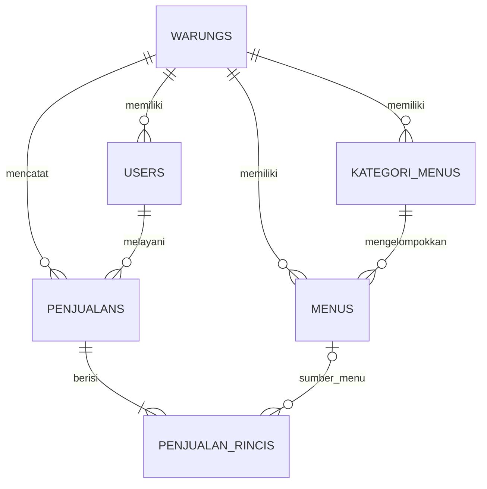

# Rencana Database LarisSama

## Status dokumen

Dokumen ini adalah rancangan logis yang dipindahkan dari `database.md` di folder Downloads. Ini belum menjadi skema database yang berjalan dan belum dibuatkan migration. Setelah migration diterapkan, migration Laravel menjadi sumber kebenaran untuk struktur fisik database; perbarui dokumen ini bila keputusan skema berubah.

## Batas otoritas

- Dokumen ini menjelaskan rancangan logis dan keputusan yang masih terbuka.
- Migration Laravel adalah sumber kebenaran untuk struktur fisik yang benar-benar berjalan.
- Kode backend adalah sumber kebenaran untuk validasi, otorisasi, dan transisi bisnis.
- Kontrak API menentukan bentuk data yang dikonsumsi frontend; frontend tidak menjadi sumber kebenaran bisnis.
- Jika sumber-sumber itu berbeda, telusuri keputusan yang mendasarinya dan perbarui artefak yang terkait. Jangan menyelesaikan konflik dengan menebak atau hanya mengubah dokumen turunan.

Rancangan ini mencakup enam tabel: `warungs`, `users`, `kategori_menus`, `menus`, `penjualans`, dan `penjualan_rincis`. Aplikasi tidak memakai tabel `mejas` atau `menu_varians`.

## Aturan inti

- Satu aplikasi mengelola banyak warung.
- Satu warung dapat memiliki banyak user; setiap user biasa terhubung ke tepat satu warung.
- `users.warung_id` boleh `NULL` hanya untuk `superadmin`.
- Warung memiliki status aktif dan rentang masa aktif.
- Kategori menu dan menu milik satu warung.
- Satu penjualan memiliki satu kasir dan banyak rincian.
- Rincian penjualan menyimpan snapshot nama dan harga supaya perubahan data menu tidak mengubah riwayat transaksi.
- Item yang tidak ada di master menu tetap disimpan di `penjualan_rincis` dengan `menu_id = NULL` dan `jenis_item = luar_menu`.

## Relasi



## Tabel dan kolom

Tipe berikut menjelaskan maksud desain. Migration harus memakai tipe Laravel yang sesuai dengan database target, menjaga presisi angka, serta membuat foreign key dan index yang diperlukan.

### `warungs`

| Kolom | Tipe/rule |
| --- | --- |
| `id` | BIGINT primary key |
| `kode` | VARCHAR(30), unique |
| `nama` | VARCHAR(150) |
| `alamat` | TEXT, nullable |
| `telepon` | VARCHAR(30), nullable |
| `logo` | VARCHAR(255), nullable |
| `tanggal_mulai` | DATE, nullable pada rancangan |
| `tanggal_berakhir` | DATE, nullable pada rancangan |
| `aktif` | BOOLEAN, default true |
| `created_at`, `updated_at` | timestamp |

### `users`

| Kolom | Tipe/rule |
| --- | --- |
| `id` | BIGINT primary key |
| `warung_id` | BIGINT foreign key, nullable hanya untuk superadmin |
| `nama` | VARCHAR(150) |
| `username` | VARCHAR(100), unique global sesuai rancangan |
| `email` | VARCHAR(150), nullable; aturan uniqueness perlu diputuskan |
| `password` | VARCHAR(255), simpan hash melalui mekanisme Laravel |
| `role` | VARCHAR(30); contoh: `superadmin`, `owner`, `manager`, `kasir`, `koki` |
| `aktif` | BOOLEAN, default true |
| `created_at`, `updated_at` | timestamp |

Relasi: satu warung memiliki banyak user. Validasi aplikasi harus memastikan user tanpa warung benar-benar ber-role `superadmin` dan user dengan role lain memiliki warung.

### `kategori_menus`

| Kolom | Tipe/rule |
| --- | --- |
| `id` | BIGINT primary key |
| `warung_id` | BIGINT foreign key |
| `nama` | VARCHAR(100) |
| `urutan` | INT, default 0 |
| `aktif` | BOOLEAN, default true |
| `created_at`, `updated_at` | timestamp |

### `menus`

| Kolom | Tipe/rule |
| --- | --- |
| `id` | BIGINT primary key |
| `warung_id` | BIGINT foreign key |
| `kategori_menu_id` | BIGINT foreign key |
| `kode` | VARCHAR(30), unique bersama `warung_id` |
| `nama` | VARCHAR(150) |
| `harga` | DECIMAL(15,2) |
| `harga_modal` | DECIMAL(15,2), nullable |
| `gambar` | VARCHAR(255), nullable |
| `deskripsi` | TEXT, nullable |
| `aktif` | BOOLEAN, default true |
| `created_at`, `updated_at` | timestamp |

Kategori dan menu harus berasal dari warung yang sama.

### `penjualans`

| Kolom | Tipe/rule |
| --- | --- |
| `id` | BIGINT primary key |
| `warung_id` | BIGINT foreign key |
| `user_id` | BIGINT foreign key kasir |
| `no_transaksi` | VARCHAR(50), unique bersama `warung_id` |
| `tanggal` | DATETIME |
| `subtotal` | DECIMAL(15,2) |
| `diskon` | DECIMAL(15,2), default 0 |
| `total` | DECIMAL(15,2) |
| `bayar` | DECIMAL(15,2) |
| `kembalian` | DECIMAL(15,2), default 0 |
| `metode_pembayaran` | VARCHAR(30); contoh: `cash`, `qris`, `transfer` |
| `status` | VARCHAR(20); contoh: `selesai`, `batal` |
| `catatan` | TEXT, nullable |
| `created_at`, `updated_at` | timestamp |

Relasi: satu warung dan satu user dapat terkait dengan banyak penjualan. User pencatat dan penjualan harus berada pada tenant yang sama, kecuali alur superadmin yang diotorisasi secara eksplisit.

### `penjualan_rincis`

| Kolom | Tipe/rule |
| --- | --- |
| `id` | BIGINT primary key |
| `penjualan_id` | BIGINT foreign key |
| `menu_id` | BIGINT foreign key, nullable untuk item luar menu |
| `jenis_item` | VARCHAR(20), default `menu`; nilai rancangan: `menu` atau `luar_menu` |
| `nama_menu` | VARCHAR(150), snapshot nama item |
| `harga` | DECIMAL(15,2), snapshot harga saat transaksi |
| `qty` | DECIMAL(10,2) |
| `diskon` | DECIMAL(15,2), default 0 |
| `subtotal` | DECIMAL(15,2) |
| `catatan` | TEXT, nullable |
| `created_at`, `updated_at` | timestamp |

Untuk item dari master, simpan `menu_id`, `jenis_item = menu`, dan snapshot `nama_menu` serta `harga`. Untuk item bebas, simpan `menu_id = NULL`, `jenis_item = luar_menu`, lalu isi nama dan harga dari input kasir yang sudah divalidasi backend. Jangan menghapus atau mengubah snapshot transaksi saat master menu berubah.

## Batas akses warung

User tenant dapat login dan memakai API hanya jika seluruh kondisi ini terpenuhi:

```text
user.aktif = TRUE
warung.aktif = TRUE
tanggal_mulai <= tanggal hari ini
tanggal_berakhir >= tanggal hari ini
```

Pemeriksaan dilakukan saat login dan pada setiap request API terautentikasi agar token lama tidak melewati masa aktif. Batas tanggal bersifat inklusif sesuai rancangan awal.

Rancangan menandai kedua tanggal sebagai nullable, tetapi belum menjelaskan arti tanggal kosong. Tetapkan perilaku nilai `NULL` sebelum membuat validasi dan middleware produksi.

## Keputusan yang harus ditetapkan sebelum migration fitur

1. Database produksi yang dituju. Konfigurasi proyek saat ini default ke SQLite dan juga menyediakan konfigurasi MySQL/MariaDB/PostgreSQL; rancangan belum memilih satu target.
2. Arti `tanggal_mulai` atau `tanggal_berakhir` yang `NULL`.
3. Apakah email nullable tetap unique global. Migration Laravel bawaan saat ini mewajibkan email dan membuatnya unique, sedangkan rancangan meminta email nullable.
4. Aturan hapus/perubahan untuk warung, user, kategori, menu, penjualan, dan rincian. Snapshot rincian perlu tetap utuh; transaksi selesai tidak boleh hilang hanya karena master dihapus. Jika belum ada keputusan, gunakan `RESTRICT` sebagai default aman.
5. Cara database dan aplikasi mencegah `kategori_menu_id`, `menu_id`, kasir, dan penjualan menghubungkan data dari warung berbeda, termasuk apakah engine target akan memakai foreign key gabungan dengan `warung_id`.
6. Batas nilai dan pembulatan uang, serta rumus subtotal/diskon header dan rincian.
7. Apakah daftar nilai role, metode pembayaran, status, dan `jenis_item` dijaga sebagai konstanta/enum aplikasi atau constraint database. Rancangan saat ini menyebut kolom VARCHAR.
8. Apakah superadmin dapat membuat transaksi atas nama warung, atau hanya mengelola data warung. Rancangan hanya menetapkan `warung_id = NULL` untuk akun superadmin.
9. Perilaku idempotensi untuk request pembuatan/finalisasi penjualan yang dapat dicoba ulang, agar retry tidak menggandakan transaksi.
10. Arti zona waktu pada `penjualans.tanggal`: apakah itu instant tersimpan dalam UTC atau waktu lokal warung, serta bagaimana zona waktu bisnis ditetapkan.

## Kondisi proyek saat dokumen dibuat

Backend masih berupa starter Laravel. Migration awal Laravel sudah membuat `users` dengan `name`, `email` non-null unique, `email_verified_at`, `password`, `remember_token`, serta tabel session dan password reset. Ini belum sama dengan rancangan di atas. Periksa apakah migration awal pernah dijalankan atau database sudah berisi data sebelum menentukan cara transisi; jangan mengubah migration yang telah dipakai bersama.
