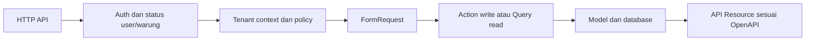

# Rancangan Backend LarisSama

Status: implementasi backend sedang berjalan. Migration delapan tabel bisnis dan FK tenant gabungan berhasil diterapkan pada database development lokal MySQL 8.0.40; route awal auth, admin, katalog, transaksi, dan laporan tersedia. Database lama yang sudah berisi user belum dapat di-upgrade sampai pemetaan identitas dan tenant ditetapkan. Beberapa feature test transaksi sudah lulus, termasuk create, snapshot, scope tenant, laporan, retry, rollback, dan sebagian pembelian ringkas/rinci; cakupan auth/admin/katalog, seluruh acceptance transaksi, dan OpenAPI conformance belum lengkap. Semua operasi tetap DRAFT. Dasar: [delapan tabel](../../database/README.md), [aturan backend](../../AGENTS.md), dan keputusan K01–K16 di [register keputusan](DECISIONS.md). Pilihan bertanda Dxx yang parsial/terbuka masih menunggu penetapan atau bukti. Urutan pekerjaan dan bukti pelaksanaan berada di [tracker](../../IMPLEMENTATION_PROGRESS.md).

## Kondisi awal yang diamati

- composer.json meminta PHP ^8.3 dan Laravel ^13.17; itu constraint proyek, bukan bukti runtime terpasang.
- Schema `users` sudah memakai `nama`, `username`, `email` nullable unik, `warung_id`, `role`, dan `aktif`; model memiliki relasi ke `Warung`. Migration delapan tabel bisnis berhasil diterapkan pada clean-install lokal. Migration cache/jobs dan `personal_access_tokens` adalah infrastruktur.
- `bootstrap/app.php` mendaftarkan API. Route tersedia untuk login, profil, logout, administrasi warung + owner awal, profil warung sendiri, user, katalog, penjualan, pembelian, dan laporan. Semua operasi masih DRAFT karena belum ada cakupan test/conformance penuh sesuai milestone.
- Test transaksi terisolasi membuktikan sebagian request, role/scope, snapshot, agregasi periode, retry dan atomisitas di MySQL; rincian run ada di [tracker](../../IMPLEMENTATION_PROGRESS.md). Belum ada bukti lengkap auth, admin, katalog, semua matriks tenant/role, dan contract runtime.
- Pemeriksaan 2026-10-04: PHP dan Composer tidak tersedia di host, tetapi image Docker opsional menyediakan PHP 8.3.35 dan Composer 2.10.3. Clean-install migrations serta harness test terisolasi diverifikasi pada MySQL 8.0.40; upgrade data lama belum diverifikasi (lihat `DB-MIGRATION-001`).

## Modul dan hasil bagi pengguna

| Modul | Tabel | Perilaku yang direncanakan |
| --- | --- | --- |
| Akses | warungs, users | Login, profil, logout, pembatasan user/warung aktif, izin role. |
| Administrasi | warungs, users | Superadmin mengelola warung platform; provisioning membuat warung dan owner awal secara atomik. Owner mengelola seluruh akses tenant sendiri, termasuk delegasi role user. |
| Katalog | kategori_menus, menus | Daftar, detail, tambah, ubah kategori/menu dan status aktif. |
| Penjualan | penjualans, penjualan_rincis | Catat menu terdaftar, baca riwayat/detail, pertahankan snapshot nama/harga jual. |
| Pembelian | pembelians, pembelian_rincis | Catat pembelian bahan rinci atau ringkas, baca riwayat/detail. |
| Laporan | query header transaksi | Pendapatan penjualan dan total pembelian dalam periode terpilih, terpisah per warung. |

Tidak ada workflow dapur atau pengaitan pembelian dengan stok/resep. Field legacy `harga_modal` tidak dipakai oleh API penjualan/pembelian. Perhitungan HPP atau laba bukan keluaran yang disepakati.

## Alur request dan struktur kode yang disarankan



Urutan aktual middleware/binding harus memastikan resource tenant lain tidak dapat diakses sebelum policy dijalankan. Route binding ID saja tidak cukup.

```text
routes/api.php
app/Http/Controllers/Api/V1/{Auth,AdminWarung,CurrentWarung,User,KategoriMenu,Menu,Penjualan,Pembelian,Laporan}Controller.php
app/Http/Requests/                      validasi struktur dan field
app/Http/Resources/                     serialisasi sesuai kontrak
app/Http/Middleware/                    auth, status aktif, tenant context
app/Policies/                          izin tindakan dan scope
app/Actions/{Penjualan,Pembelian}/      write transaksi eksplisit dan atomik
app/Actions/Laporan/                   agregasi header read-only
app/Http/Controllers/                  query daftar/detail tenant-scoped
app/Support/                           helper decimal/tenant bila diperlukan
app/Models/                            delapan entitas bisnis
tests/{Unit,Feature,Integration,Contract}/
```

Nama class adalah usulan organisasi; tidak perlu membuat semua folder atau menambahkan repository abstraction lebih dulu. Controller hanya menghubungkan HTTP, authorization, action/query, dan resource. Efek wajib tidak disembunyikan dalam observer/listener. Framework/package API diverifikasi saat implementasi terhadap versi yang terpasang.

## Pembagian peran yang disetujui (D04)

| Tanggung jawab inti | superadmin | owner | manager | kasir |
| --- | --- | --- | --- | --- |
| Mengelola warung pada jalur platform dan membuat owner awal | Ya | Tidak | Tidak | Tidak |
| Melihat profil warung sendiri | Tidak melalui jalur tenant | Ya | Ya | Ya |
| Mengelola user dan role tenant sendiri, termasuk menetapkan owner tambahan | Tidak melalui jalur tenant | Ya | Tidak | Tidak |
| Membaca katalog | Tidak melalui jalur tenant | Ya | Ya | Ya, hanya yang aktif |
| Membuat dan mengubah kategori/menu | Tidak melalui jalur tenant | Ya | Ya | Tidak |
| Membaca seluruh penjualan warung | Tidak melalui jalur tenant | Ya | Ya | Tidak |
| Membaca penjualan miliknya sendiri | Tidak melalui jalur tenant | Ya | Ya | Ya |
| Membuat penjualan | Tidak melalui jalur tenant | Ya | Tidak | Ya |
| Membaca dan membuat pembelian | Tidak melalui jalur tenant | Ya | Ya | Tidak |
| Membaca laporan penjualan dan pembelian | Tidak melalui jalur tenant | Ya | Ya | Tidak |
| Memilih tenant atau bertindak sebagai tenant tanpa identitas tenant | Tidak | Tidak | Tidak | Tidak |

Matriks ini diputuskan user pada 2026-10-05. Owner berarti pemilik warung dan seluruh izin tenant-nya dibatasi ke `warung_id` dari token; satu warung boleh memiliki beberapa owner. Owner dapat menetapkan role `owner`, `manager`, atau `kasir` kepada user di warungnya, tetapi tidak dapat membuat superadmin atau mengelola warung lain. Manager dan kasir mempertahankan batas di tabel. Superadmin memakai jalur platform terpisah. Policy serta kontrak OpenAPI sudah diselaraskan, tetapi conformance role owner dan matriks lengkap tetap harus lulus sebelum operasi berstatus READY. Perubahan email/username tetap tunduk pada D12.

## Integritas data dan migration

1. Inventaris tabel/users yang sudah ada dan riwayat migration di environment tujuan. Jangan menjalankan composer setup tanpa meninjau script migrate-nya.
2. Buat warungs, lalu sesuaikan users menggunakan migration maju jika migration awal sudah dibagikan. Pemetaan user lama ke warung perlu sumber data berwenang.
3. Buat kategori_menus sebelum menus; buat penjualans sebelum penjualan_rincis; buat pembelians sebelum pembelian_rincis.
4. Pertahankan unique global warungs.kode/users.username serta unique `(warung_id, kode)` menu dan `(warung_id, no_transaksi)` masing-masing header; parent tenant-owned menyediakan unique `(warung_id, id)`.
5. Gunakan FK/index relasi dan index laporan `(warung_id, tanggal, id)`; validasi pilihan index serta filter status lewat query plan saat integrasi MySQL 8.0.40.
6. D16 menetapkan FK tenant gabungan. Backend tetap membatasi query/action ke warung terautentikasi dan database menolak relasi silang tenant.
7. Rincian tidak memiliki endpoint CRUD bebas. Tindakan bisnis mengelola header dan rincian dalam satu transaksi. D06/D11 menentukan koreksi dan penghapusan.

## Invariant dan rancangan tindakan

| ID | Invariant | Penegakan |
| --- | --- | --- |
| INV01 | Warung biasa berasal dari user terautentikasi. | Abaikan sebagai otoritas dan tolak field tenant yang tidak didukung pada request; filter setiap query/route lookup. |
| INV02 | Semua referensi milik warung yang sama. | Scope aplikasi ditambah FK gabungan database untuk kategori/menu, user pencatat, header, dan detail; detail juga dibaca melalui header terscope. |
| INV03 | User aktif dan warung aktif dalam masa berlaku. | Periksa login serta setiap request; `tanggal_mulai` NULL tidak membatasi awal, `tanggal_berakhir` NULL tidak membatasi akhir, dan tanggal terisi inklusif; token kedaluwarsa atau status nonaktif tidak boleh diterima. |
| INV04 | Header memiliki >= 1 detail, tanpa penyimpanan sebagian. | Validasi array dan DB transaction; kegagalan detail me-rollback header, total, nomor, serta efek retry. |
| INV05 | Nominal eksak dan dihitung backend. | Wire dan penyimpanan memakai decimal string eksak dua angka pecahan; round half-up per rincian. Batas lain/rumus final mengikuti D05; total dari detail, bukan total client. |
| INV06 | Setiap penjualan memilih menu terdaftar pada warung yang sama; riwayat menyimpan nama/harga jual saat transaksi. | `menu_id` wajib pada detail, menu di-resolve di scope warung dan snapshot disimpan dalam action; perubahan master tidak menulis ulang rincian. |
| INV07 | Pembelian ringkas sah. | `nama_item` + `subtotal` menjadi satu detail; qty/satuan/harga_satuan nullable. |
| INV08 | Pembelian tidak memengaruhi penjualan/menu/stok. | Action hanya menulis pembelian dan infrastruktur yang disetujui. |
| INV09 | Retry/concurrency tidak menggandakan transaksi. | `Idempotency-Key` durable disimpan bersama transaksi; payload sama replay hasil awal, payload berbeda pada key sama menghasilkan 409. Buktikan dengan dua request/koneksi sebelum handoff. |
| INV10 | Laporan tidak bocor tenant atau menggandakan header. | Aggregate header terfilter; jangan SUM(header.total) setelah join one-to-many rincian. |
| INV11 | Kontrak mencerminkan implementasi. | Response divalidasi terhadap schema, parameter/peran diuji; handoff READY membutuhkan bukti. |

### Penjualan

Action membaca setiap menu dalam scope warung, memeriksa aktif, mengambil harga/nama jual yang sah saat pencatatan, menghitung setiap subtotal, lalu menyimpan header dan semua snapshot detail. Setiap rincian harus mempunyai `menu_id`; transaksi dengan item bebas tidak diterima. Harga kiriman client tidak menjadi otoritas. D05 menentukan respons terhadap perubahan harga bersamaan; snapshot harus konsisten dengan pembacaan dalam transaksi.

Baseline nominal D05 sudah disetujui: wire/penyimpanan decimal string dengan dua angka pecahan dan pembulatan half-up per rincian. Rumus diskon, validasi pembayaran cash/QRIS/transfer, harga nol, batas angka, dan qty pecahan tetap perlu dicatat sebelum aksi penjualan final. `bayar` bukan pendapatan; pendapatan memakai `total` sesuai D08. Kebijakan cancel penjualan masih D06.

Action menyimpan kunci idempotensi, hash payload kanonis, header, dan detail dalam transaksi database yang sama. Retry dengan key dan payload sama membaca ulang transaksi pertama; payload berbeda mendapat 409. Kegagalan di detail terakhir tidak meninggalkan header/rincian atau klaim key awal.

### Pembelian

Ringkas: satu detail `nama_item="Belanja di pasar"`, `subtotal="150000.00"`; qty/satuan/harga_satuan NULL. Rinci: beberapa nama bahan dengan qty/harga_satuan, subtotal dihitung backend. Bentuk wire kandidat berada di OpenAPI; D10 menutup kasus input sebagian dan mismatch subtotal. Tidak ada lookup menu atau syarat master bahan.

Action menetapkan warung/user dari identitas terautentikasi, menghitung total semua detail, dan menyimpan semuanya atomik. Input header.total tidak dipercaya. Bentuk ringkas dan rinci menggunakan endpoint serta tabel yang sama. Tidak ada status `selesai`/`batal` pembelian yang boleh dibuat diam-diam; D11 harus menambah schema dan kontrak jika dibutuhkan.

### Laporan periode

Timestamp disimpan UTC. Setiap warung memakai identifier IANA pada `warungs.timezone`; zona kosong atau invalid menolak akses tenant sampai diperbaiki. Periksa masa aktif dengan mengubah waktu saat ini dari UTC ke timezone warung, lalu bandingkan tanggal lokal inklusif terhadap `tanggal_mulai`/`tanggal_berakhir`. Untuk laporan, ubah awal `date_from` dan awal hari setelah `date_to` dari timezone warung ke UTC, lalu query rentang `[awal, awal_hari_berikutnya)`; jangan memakai `23:59:59` yang bisa melewatkan pecahan detik.

- Pendapatan: jumlah `penjualans.total` dengan status selesai pada periode. Tidak mengambil bayar/kembalian, nama/harga menu terbaru, atau total pembelian.
- Pembelian: jumlah `pembelians.total` pada periode; aturan transaksi yang dikoreksi menunggu D11.
- Count adalah jumlah header; detail tidak menggandakan count maupun total. Summary mencakup semua hasil filter, tidak hanya halaman list.
- Periode kosong menghasilkan count 0 dan total `"0.00"` setelah query berhasil. Error jaringan/izin tidak boleh dikonversi ke nol oleh frontend.

## Keamanan, operasional, dan handoff

Password/token tidak keluar resource atau log. Login menerbitkan Sanctum bearer token selama 30 hari; rate limit membatasi 5 percobaan per menit berdasarkan username dan IP. Middleware memeriksa status user dan warung pada setiap request bearer. HTTPS/CORS, penyimpanan rahasia, dan detail deployment masih perlu ditetapkan sebelum BE-102/BE-502 selesai. Error JSON tidak menampilkan SQL atau kredensial; request ID membantu penelusuran. Halaman di luar scope menggunakan respons yang konsisten menurut D13.

Runbook rilis yang dibuat pada BE-502 harus berisi prasyarat versi, konfigurasi tanpa rahasia, migrasi upgrade, backup/restore yang diuji pada salinan, rollback aplikasi, endpoint health, log, dan keterbatasan. Hindari migration destruktif pada data bersama.

Satu fitur selesai setelah task, test, kontrak, contoh payload, dan bukti commit terhubung di tracker. Frontend menerima operationId yang READY beserta base URL environment, auth, parameter, contoh sukses/error, dan release commit. Kontrak draft tidak menjadi bukti endpoint sudah tersedia.
