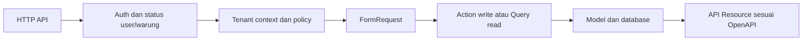

# Rancangan Backend LarisSama

Status: rancangan, belum implementasi. Dasar: [delapan tabel](../../database/README.md), [aturan backend](../../AGENTS.md), dan keputusan K01–K08 di [register keputusan](DECISIONS.md). Pilihan bertanda Dxx masih menunggu penetapan. Urutan pekerjaan dan bukti pelaksanaan berada di [tracker](../../IMPLEMENTATION_PROGRESS.md).

## Kondisi awal yang diamati

- composer.json meminta PHP ^8.3 dan Laravel ^13.17; itu constraint proyek, bukan bukti runtime terpasang.
- Model User masih bawaan (`name`, `email`, `password`); migration bisnis belum ada. Migration users/cache/jobs adalah infrastruktur awal.
- bootstrap/app.php mendaftarkan web, console, dan health /up; routes/api.php belum ada.
- Test yang tersedia hanya contoh Unit dan Feature. Tidak ada bukti tenant, nominal, transaksi, atau kontrak bisnis sudah lulus.
- Pemeriksaan 2026-10-04: PHP dan Composer tidak tersedia dalam shell sesi ini. Setup runtime dicatat sebagai task M0; penulisan rancangan dapat berjalan.

## Modul dan hasil bagi pengguna

| Modul | Tabel | Perilaku yang direncanakan |
| --- | --- | --- |
| Akses | warungs, users | Login, profil, logout, pembatasan user/warung aktif, izin role. |
| Administrasi | warungs, users | Superadmin mengelola warung; kandidat provisioning membuat warung dan owner awal secara atomik (D04). Owner mengelola user warung. |
| Katalog | kategori_menus, menus | Daftar, detail, tambah, ubah kategori/menu dan status aktif. |
| Penjualan | penjualans, penjualan_rincis | Catat menu terdaftar, baca riwayat/detail, pertahankan snapshot nama/harga jual. |
| Pembelian | pembelians, pembelian_rincis | Catat pembelian bahan rinci atau ringkas, baca riwayat/detail. |
| Laporan | query header transaksi | Pendapatan penjualan dan total pembelian dalam periode terpilih, terpisah per warung. |

Tidak ada workflow dapur atau pengaitan pembelian dengan stok/resep. Field legacy `harga_modal` tidak dipakai oleh API penjualan/pembelian. Perhitungan HPP atau laba bukan keluaran yang disepakati.

## Alur request dan struktur kode yang disarankan



Urutan aktual middleware/binding harus memastikan resource tenant lain tidak dapat diakses sebelum policy dijalankan. Route binding ID saja tidak cukup.

```text
routes/api.php
app/Http/Controllers/Api/V1/{Auth,Admin,KategoriMenu,Menu,Penjualan,Pembelian,Laporan}Controller.php
app/Http/Requests/                      validasi struktur dan field
app/Http/Resources/                     serialisasi sesuai kontrak
app/Http/Middleware/                    auth, status aktif, tenant context
app/Policies/                          izin tindakan dan scope
app/Actions/{Penjualan,Pembelian}/      write dalam transaksi eksplisit
app/Queries/                           daftar, detail, agregasi read-only
app/Support/                           helper decimal/tenant bila diperlukan
app/Models/                            delapan entitas bisnis
tests/{Unit,Feature,Integration,Contract}/
```

Nama class adalah usulan organisasi; tidak perlu membuat semua folder atau menambahkan repository abstraction lebih dulu. Controller hanya menghubungkan HTTP, authorization, action/query, dan resource. Efek wajib tidak disembunyikan dalam observer/listener. Framework/package API diverifikasi saat implementasi terhadap versi yang terpasang.

## Matriks izin kandidat (D04)

| Operasi | superadmin | owner | manager | kasir | koki |
| --- | --- | --- | --- | --- | --- |
| Kelola warung dan owner awal | Ya, jalur admin | Tidak | Tidak | Tidak | Tidak |
| Lihat profil warung sendiri | Tidak melalui jalur tenant | Ya | Ya | Ya | Belum ditetapkan |
| Kelola user warung | Tidak melalui jalur tenant | Ya | Tidak | Tidak | Tidak |
| Baca katalog | Tidak melalui jalur tenant | Ya | Ya | Ya | Tidak |
| Ubah katalog | Tidak melalui jalur tenant | Ya | Ya | Tidak | Tidak |
| Buat penjualan | Tidak melalui jalur tenant | Ya | Ya | Ya | Tidak |
| Riwayat penjualan | Tidak melalui jalur tenant | Semua di warung | Semua di warung | Milik sendiri, kandidat | Tidak |
| Pembelian dan laporan periode | Tidak melalui jalur tenant | Ya | Ya | Tidak | Tidak |

Matriks ini belum menjadi izin final. Field role dari client tidak boleh menaikkan hak tanpa policy. Jalur pengelolaan user tenant tidak boleh membuat superadmin; provisioning owner awal memakai tindakan admin tersendiri. Perubahan email/username tetap tunduk pada D12.

## Integritas data dan migration

1. Inventaris tabel/users yang sudah ada dan riwayat migration di environment tujuan. Jangan menjalankan composer setup tanpa meninjau script migrate-nya.
2. Buat warungs, lalu sesuaikan users menggunakan migration maju jika migration awal sudah dibagikan. Pemetaan user lama ke warung perlu sumber data berwenang.
3. Buat kategori_menus sebelum menus; buat penjualans sebelum penjualan_rincis; buat pembelians sebelum pembelian_rincis.
4. Pertahankan unique global warungs.kode/users.username serta unique `(warung_id, kode)` menu dan `(warung_id, no_transaksi)` masing-masing header.
5. Gunakan FK/index relasi; kandidat index laporan `(warung_id, tanggal, id)`, dan filter status penjualan sesuai hasil query plan. Pilihan fisik menunggu D01.
6. D01 menentukan strategi FK tenant gabungan. Walaupun ID unik global, backend tetap mengecek kategori/menu/user dari warung yang sama. Detail mengikuti tenant melalui header induk.
7. Rincian tidak memiliki endpoint CRUD bebas. Tindakan bisnis mengelola header dan rincian dalam satu transaksi. D06/D11 menentukan koreksi dan penghapusan.

## Invariant dan rancangan tindakan

| ID | Invariant | Penegakan |
| --- | --- | --- |
| INV01 | Warung biasa berasal dari user terautentikasi. | Abaikan sebagai otoritas dan tolak field tenant yang tidak didukung pada request; filter setiap query/route lookup. |
| INV02 | Semua referensi milik warung yang sama. | Validasi tenant dan FK sesuai engine; detail dibaca melalui header terscope. |
| INV03 | User aktif dan warung aktif dalam masa berlaku. | Periksa login serta setiap request; token lama tidak melewati penonaktifan/kedaluwarsa. |
| INV04 | Header memiliki >= 1 detail, tanpa penyimpanan sebagian. | Validasi array dan DB transaction; kegagalan detail me-rollback header, total, nomor, serta efek retry. |
| INV05 | Nominal eksak dan dihitung backend. | Decimal, validasi batas/rounding D05; total dari detail, bukan total client. |
| INV06 | Setiap penjualan memilih menu terdaftar pada warung yang sama; riwayat menyimpan nama/harga jual saat transaksi. | `menu_id` wajib pada detail, menu di-resolve di scope warung dan snapshot disimpan dalam action; perubahan master tidak menulis ulang rincian. |
| INV07 | Pembelian ringkas sah. | `nama_item` + `subtotal` menjadi satu detail; qty/satuan/harga_satuan nullable. |
| INV08 | Pembelian tidak memengaruhi penjualan/menu/stok. | Action hanya menulis pembelian dan infrastruktur yang disetujui. |
| INV09 | Retry/concurrency tidak menggandakan transaksi. | D09 harus diputuskan dan diuji dengan dua request/koneksi; disable retry UI saja tidak memenuhi syarat. |
| INV10 | Laporan tidak bocor tenant atau menggandakan header. | Aggregate header terfilter; jangan SUM(header.total) setelah join one-to-many rincian. |
| INV11 | Kontrak mencerminkan implementasi. | Response divalidasi terhadap schema, parameter/peran diuji; handoff READY membutuhkan bukti. |

### Penjualan

Action membaca setiap menu dalam scope warung, memeriksa aktif, mengambil harga/nama jual yang sah saat pencatatan, menghitung setiap subtotal, lalu menyimpan header dan semua snapshot detail. Setiap rincian harus mempunyai `menu_id`; transaksi dengan item bebas tidak diterima. Harga kiriman client tidak menjadi otoritas. D05 menentukan respons terhadap perubahan harga bersamaan; snapshot harus konsisten dengan pembacaan dalam transaksi.

Kandidat rumus D05: `subtotal_rinci = round(harga_jual × qty - diskon_rinci, 2)`; `subtotal_header = SUM(subtotal_rinci)`; `total = subtotal_header - diskon_header`; `kembalian = bayar - total` untuk cash. Validasi mencegah total negatif/diskon berlebih; QRIS/transfer perlu aturan eksplisit. `bayar` bukan pendapatan. Kebijakan cancel penjualan masih D06.

Action harus mengaitkan nomor transaksi dan hasil retry dengan commit bisnis yang sama. Tentukan durable storage dan perilaku konflik D09 sebelum membuat endpoint write siap produksi. Kegagalan di detail terakhir tidak meninggalkan header/rincian awal.

### Pembelian

Ringkas: satu detail `nama_item="Belanja di pasar"`, `subtotal="150000.00"`; qty/satuan/harga_satuan NULL. Rinci: beberapa nama bahan dengan qty/harga_satuan, subtotal dihitung backend. Bentuk wire kandidat berada di OpenAPI; D10 menutup kasus input sebagian dan mismatch subtotal. Tidak ada lookup menu atau syarat master bahan.

Action menetapkan warung/user dari identitas terautentikasi, menghitung total semua detail, dan menyimpan semuanya atomik. Input header.total tidak dipercaya. Bentuk ringkas dan rinci menggunakan endpoint serta tabel yang sama. Tidak ada status `selesai`/`batal` pembelian yang boleh dibuat diam-diam; D11 harus menambah schema dan kontrak jika dibutuhkan.

### Laporan periode

Kandidat D08: query `tanggal >= start_of_day(date_from, zone)` dan `tanggal < start_of_next_day(date_to, zone)` setelah dikonversi ke zona penyimpanan. Tanggal akhir inklusif bagi pengguna; jangan memakai 23:59:59 yang bisa melewatkan pecahan detik.

- Pendapatan: jumlah `penjualans.total` dengan status selesai pada periode. Tidak mengambil bayar/kembalian, nama/harga menu terbaru, atau total pembelian.
- Pembelian: jumlah `pembelians.total` pada periode; aturan transaksi yang dikoreksi menunggu D11.
- Count adalah jumlah header; detail tidak menggandakan count maupun total. Summary mencakup semua hasil filter, tidak hanya halaman list.
- Periode kosong menghasilkan count 0 dan total `"0.00"` setelah query berhasil. Error jaringan/izin tidak boleh dikonversi ke nol oleh frontend.

## Keamanan, operasional, dan handoff

Password/token tidak keluar resource atau log. Sanctum bearer token sudah dipilih; rate limit login, token expiry/revokasi, HTTPS/CORS, penyimpanan rahasia, dan detail deployment masih perlu ditetapkan di D02 sebelum BE-001/BE-502 selesai. Error JSON tidak menampilkan SQL atau kredensial; request ID membantu penelusuran. Halaman di luar scope menggunakan respons yang konsisten menurut D13.

Runbook rilis yang dibuat pada BE-502 harus berisi prasyarat versi, konfigurasi tanpa rahasia, migrasi upgrade, backup/restore yang diuji pada salinan, rollback aplikasi, endpoint health, log, dan keterbatasan. Hindari migration destruktif pada data bersama.

Satu fitur selesai setelah task, test, kontrak, contoh payload, dan bukti commit terhubung di tracker. Frontend menerima operationId yang READY beserta base URL environment, auth, parameter, contoh sukses/error, dan release commit. Kontrak draft tidak menjadi bukti endpoint sudah tersedia.
