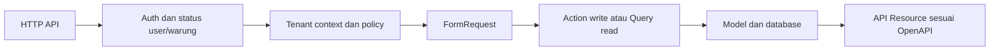

# Rancangan Backend LarisSama

Status per 2026-10-08: seluruh 37 operationId memiliki handler dan status `READY_FOR_FRONTEND` untuk alur utama. D18 pesanan/pembayaran lulus 78 test / 30.684 assertions; BE-107 menambah akses baca superadmin dengan pilihan `warung_id` eksplisit dan BE-108 menambah seluruh aksi transaksi superadmin dengan scope body eksplisit. BE-108 lulus focused 73 test / 35.449 assertions pada MySQL 8.0.40 Compose disposable; Pint dan validator OpenAPI 3.1 lulus. Full regression G3/G4, conformance edge-case, dan production deployment tetap terbuka; status task serta bukti terkini ada di [tracker](../../IMPLEMENTATION_PROGRESS.md), [keputusan](DECISIONS.md), dan [rencana test](TEST_PLAN.md).

## Kondisi awal yang diamati

- composer.json meminta PHP ^8.3 dan Laravel ^13.17; itu constraint proyek, bukan bukti runtime terpasang.
- Schema `users` memakai `nama`, `username`, `email` nullable unik, `warung_id`, `role`, dan `aktif`; model memiliki relasi ke `Warung`. Migration delapan tabel bisnis berhasil diterapkan pada clean install MySQL 8.0.40. Target produksi dikonfirmasi kosong; migration cache/jobs dan `personal_access_tokens` adalah infrastruktur.
- `bootstrap/app.php` mendaftarkan operationId untuk login, admin warung, profil/user, katalog, pesanan/pembayaran, pembelian, dan laporan. D06 menambah koreksi, pembatalan, dan retur penjualan; D18 menambah pembayaran terpisah. Status kontrak alur utama tiap operasi mengikuti `x-contract-status` di OpenAPI; edge-case lanjutan tetap ada pada `x-deferred-verification`.
- Feature suite mencakup alur auth/admin/katalog/transaksi/laporan, tenant dan role pada skenario terpilih, serta request/response contract pada status terpilih. Batas cakupan yang tersisa dicatat pada [tracker](../../IMPLEMENTATION_PROGRESS.md) dan artefak test.
- Verifikasi dilakukan melalui Docker Compose terisolasi dengan PHP 8.3 dan MySQL 8.0.40. Upgrade data non-kosong di luar target produksi fresh install belum didukung tanpa pemetaan dan akan dihentikan oleh guard migration.

## Modul dan hasil bagi pengguna

| Modul | Tabel | Perilaku yang direncanakan |
| --- | --- | --- |
| Akses | warungs, users | Login, profil, logout, pembatasan user/warung aktif, izin role. |
| Administrasi | warungs, users | Superadmin mengelola warung platform; provisioning membuat warung dan owner awal secara atomik. Owner mengelola seluruh akses tenant sendiri, termasuk delegasi role user. |
| Katalog | kategori_menus, menus | Daftar, detail, tambah, ubah kategori/menu dan status aktif. |
| Penjualan | penjualans, penjualan_rincis, penjualan_koreksis, penjualan_returs | Catat menu terdaftar, simpan snapshot, koreksi/pembatalan beralasan dalam 72 jam, serta retur nominal penuh/sebagian append-only. |
| Pembelian | pembelians, pembelian_rincis | Catat pembelian bahan rinci atau ringkas, baca riwayat/detail. |
| Laporan | query header transaksi dan event retur | Pendapatan bersih penjualan mengurangi retur yang terjadi pada periode; total pembelian tetap terpisah per warung. |

Tidak ada workflow dapur atau pengaitan pembelian dengan stok/resep. Field legacy `harga_modal` tidak dipakai oleh API penjualan/pembelian. Perhitungan HPP atau laba bukan keluaran yang disepakati.

## Alur request dan struktur kode yang disarankan



Urutan aktual middleware/binding harus memastikan resource tenant lain tidak dapat diakses sebelum policy dijalankan. Route binding ID saja tidak cukup.

```text
routes/api.php
app/Http/Controllers/Api/V1/{Auth,AdminWarung,CurrentWarung,User,KategoriMenu,Menu,Penjualan,Pembelian,Laporan}Controller.php
app/Http/Requests/                      validasi struktur dan field
app/Http/Resources/                     serialisasi sesuai kontrak
app/Http/Middleware/                    auth, status aktif, tenant context
app/Policies/                          izin tindakan dan scope
app/Actions/{Penjualan,Pembelian}/      write transaksi eksplisit dan atomik
app/Actions/Laporan/                   agregasi header read-only
app/Http/Controllers/                  query daftar/detail tenant-scoped
app/Support/                           helper decimal/tenant bila diperlukan
app/Models/                            delapan entitas bisnis
tests/{Unit,Feature,Integration,Contract}/
```

Nama class adalah usulan organisasi; tidak perlu membuat semua folder atau menambahkan repository abstraction lebih dulu. Controller hanya menghubungkan HTTP, authorization, action/query, dan resource. Efek wajib tidak disembunyikan dalam observer/listener. Framework/package API diverifikasi saat implementasi terhadap versi yang terpasang.

## Pembagian peran yang disetujui (D04)

| Tanggung jawab inti | superadmin | owner | manager | kasir |
| --- | --- | --- | --- | --- |
| Mengelola warung pada jalur platform dan membuat owner awal | Ya | Tidak | Tidak | Tidak |
| Membaca data tenant yang dipilih lewat GET `warung_id` | Ya | Tenant dari token | Tenant dari token | Tenant dari token |
| Mengelola user dan role tenant | Ya, `warung_id` di body | Ya | Tidak | Tidak |
| Membaca katalog | Tenant terpilih, hanya-baca | Ya | Ya | Ya, hanya yang aktif |
| Membuat dan mengubah kategori/menu | Ya, `warung_id` di body | Ya | Ya | Tidak |
| Membaca seluruh penjualan warung dan antrean lunas/belum lunas | Tenant terpilih, hanya-baca | Ya | Ya | Ya |
| Membuat pesanan penjualan | Ya, `warung_id` di body | Ya | Ya | Ya |
| Mengedit/membatalkan pesanan belum lunas | Ya, `warung_id` di body | Ya | Ya | Ya |
| Mencatat pembayaran pesanan | Ya, `warung_id` di body | Ya | Ya | Ya |
| Koreksi/batal penjualan lunas dalam 72 jam dari pembayaran | Ya, `warung_id` di body | Ya | Ya | Tidak |
| Mencatat retur penjualan | Ya, `warung_id` di body | Ya | Ya | Tidak |
| Membaca pembelian | Tenant terpilih, hanya-baca | Ya | Ya | Tidak |
| Membuat/mengoreksi/membatalkan pembelian | Ya, `warung_id` di body | Ya | Ya | Tidak |
| Membaca laporan penjualan dan pembelian | Tenant terpilih, hanya-baca | Ya | Ya | Tidak |
| Menyamar sebagai user tenant saat menulis | Tidak; transaksi tetap beratribusi superadmin | Tenant dari token | Tenant dari token | Tenant dari token |

Matriks ini mengikuti revisi D04 user pada 2026-10-09. Setiap GET data tenant oleh superadmin wajib menyertakan `warung_id` pada query; setiap mutasi data tenant wajib menyertakan `warung_id` pada body. Scope detail harus cocok dengan warung resource. Tenant memakai warung dari token dan dilarang mengirim field tersebut. Superadmin dapat membuat/mengubah user tenant, kategori, menu, penjualan, dan pembelian di warung pilihan. Form user tenant hanya dapat menetapkan owner/manager/kasir; akun superadmin dikelola terpisah melalui jalur platform. Aksi transaksi mencakup pembayaran, koreksi, pembatalan, dan retur; identitas superadmin dicatat terpisah dari `user_id` tenant. Owner dapat menetapkan role owner/manager/kasir di warungnya; manager/kasir mengikuti alur pesanan dan pembayaran D18. Koreksi penjualan lunas tetap tunduk pada batas 72 jam sejak pembayaran.

## Integritas data dan migration

1. Inventaris tabel/users yang sudah ada dan riwayat migration di environment tujuan. Jangan menjalankan composer setup tanpa meninjau script migrate-nya.
2. Buat warungs, lalu sesuaikan users menggunakan migration maju jika migration awal sudah dibagikan. Pemetaan user lama ke warung perlu sumber data berwenang.
3. Buat kategori_menus sebelum menus; buat penjualans sebelum penjualan_rincis; buat pembelians sebelum pembelian_rincis.
4. Pertahankan unique global warungs.kode/users.username serta unique `(warung_id, kode)` menu dan `(warung_id, no_transaksi)` masing-masing header; parent tenant-owned menyediakan unique `(warung_id, id)`.
5. Gunakan FK/index relasi dan index laporan `(warung_id, tanggal, id)`; validasi pilihan index serta filter status lewat query plan saat integrasi MySQL 8.0.40.
6. D16 menetapkan FK tenant gabungan. Backend tetap membatasi query/action ke warung terautentikasi dan database menolak relasi silang tenant.
7. Rincian tidak memiliki endpoint CRUD bebas. Tindakan bisnis mengelola header dan rincian dalam satu transaksi. D06/D11 mengatur koreksi, retur, dan pembatalan dengan alasan serta audit; hard-delete transaksi dilarang.

## Invariant dan rancangan tindakan

| ID | Invariant | Penegakan |
| --- | --- | --- |
| INV01 | Warung biasa berasal dari user terautentikasi. | Abaikan sebagai otoritas dan tolak field tenant yang tidak didukung pada request; filter setiap query/route lookup. |
| INV02 | Semua referensi milik warung yang sama. | Query user tenant memakai warung token; superadmin hanya memilih scope untuk GET. Scope aplikasi ditambah FK gabungan database untuk kategori/menu, user pencatat, header, dan detail; detail juga dibaca melalui header terscope. |
| INV03 | User aktif dan warung aktif dalam masa berlaku. | Periksa login serta setiap request; `tanggal_mulai` NULL tidak membatasi awal, `tanggal_berakhir` NULL tidak membatasi akhir, dan tanggal terisi inklusif; token kedaluwarsa atau status nonaktif tidak boleh diterima. |
| INV04 | Header memiliki >= 1 detail, tanpa penyimpanan sebagian. | Validasi array dan DB transaction; kegagalan detail me-rollback header, total, nomor, serta efek retry. |
| INV05 | Nominal eksak dan dihitung backend. | Wire dan penyimpanan memakai decimal string eksak dua angka pecahan; round half-up per rincian. Batas lain/rumus final mengikuti D05; total dari detail, bukan total client. |
| INV06 | Baris penjualan katalog memilih menu aktif dalam kategori aktif pada warung yang sama; item bebas menyimpan nama/harga snapshot tanpa relasi katalog. | `menu_id` terisi untuk baris katalog dan NULL untuk item bebas; menu/kategori dikunci dan divalidasi dalam scope warung. Subtotal dihitung di action dan perubahan master tidak menulis ulang snapshot. |
| INV07 | Pembelian ringkas sah. | `nama_item` + `subtotal` menjadi satu detail; qty/satuan/harga_satuan nullable. |
| INV08 | Pembelian tidak memengaruhi penjualan/menu/stok. | Action hanya menulis pembelian dan infrastruktur yang disetujui. |
| INV09 | Retry/concurrency tidak menggandakan transaksi. | `Idempotency-Key` dan hash berlaku tujuh hari sejak request pertama. Payload sama me-replay hasil awal dan payload berbeda menghasilkan 409 selama window. Setelah expiry, key lama tidak lagi di-replay dan pemakaian ulang diproses sebagai request baru. Metadata key/hash/expiry dilepas secara lazy dalam transaksi itu; bila request ditolak aturan bisnis dan rollback, metadata expired boleh tetap tersimpan secara fisik namun tetap dianggap expired. Tidak ada job pembersih terjadwal. Fakta transaksi serta audit tidak dihapus. |
| INV10 | Laporan tidak bocor tenant atau menggandakan header. | Aggregate header terfilter; jangan SUM(header.total) setelah join one-to-many rincian. |
| INV11 | Kontrak mencerminkan implementasi. | Response divalidasi terhadap schema, parameter/peran diuji; handoff READY membutuhkan bukti. |

### Penjualan

Action membaca dan mengunci menu serta kategori untuk setiap baris katalog dalam scope warung, memastikan keduanya aktif, mengambil harga/nama jual dari master, lalu menyimpan snapshot. Baris item bebas tidak memiliki `menu_id` dan wajib membawa nama serta harga satuan positif; backend tetap menghitung subtotal. Item bebas dan katalog dapat dicampur tanpa batas jumlah baris khusus. FK gabungan menjaga tenant untuk ID menu yang terisi. D05 menentukan nominal, diskon, dan pembulatan; snapshot tetap konsisten dalam transaksi.

Baseline nominal D05 sudah disetujui: wire/penyimpanan decimal string dengan dua angka pecahan dan pembulatan half-up per rincian. Diskon, pembayaran cash/QRIS/transfer, harga positif, kapasitas nominal, dan qty pecahan tercatat pada D05. `bayar` adalah pembayaran kasir, bukan nominal pendapatan. Pesanan pending dapat dikoreksi tanpa batas waktu sampai lunas. Koreksi penjualan lunas beralasan hanya dalam 72 jam sejak `dibayar_pada`; retur nominal append-only dapat masuk laporan pada periodenya sendiri tanpa mengubah sale snapshot atau stok (D06).

Action menyimpan kunci idempotensi, hash payload kanonis, header, dan detail dalam transaksi database yang sama. Retry dengan key dan payload sama membaca ulang transaksi pertama; payload berbeda mendapat 409. Kegagalan di detail terakhir tidak meninggalkan header/rincian atau klaim key awal.

### Pembelian

Rincian nominal: `nama_item` dan `subtotal` wajib; qty/satuan/harga_satuan boleh NULL. Rincian hitungan: `nama_item`, qty, dan harga_satuan wajib; keduanya berpasangan, `satuan` opsional, dan subtotal dihitung backend. Nilai subtotal selalu disimpan dan tidak boleh NULL; bila client mengirim subtotal pada bentuk hitungan sebagai pembanding, nilainya harus sama dengan hasil hitung backend atau request ditolak 422. Rincian nominal dan hitungan boleh dicampur, dan total header menjumlahkan subtotal seluruh baris. Tidak ada lookup menu atau syarat master bahan.

Action menetapkan warung/user dari identitas terautentikasi, menghitung total semua detail, dan menyimpan semuanya atomik. Input header.total tidak dipercaya. Bentuk ringkas dan rinci menggunakan endpoint serta tabel yang sama. Koreksi mengganti keadaan terkini secara atomik dan menulis event audit snapshot sebelum/sesudah; pembatalan hanya mengubah status tanpa hard-delete. Laporan mengecualikan header berstatus `dibatalkan`.

### Laporan periode

Timestamp disimpan UTC. Setiap warung memakai identifier IANA pada `warungs.timezone`; zona kosong atau invalid menolak akses tenant sampai diperbaiki. Periksa masa aktif dengan mengubah waktu saat ini dari UTC ke timezone warung, lalu bandingkan tanggal lokal inklusif terhadap `tanggal_mulai`/`tanggal_berakhir`. Untuk laporan, ubah awal `date_from` dan awal hari setelah `date_to` dari timezone warung ke UTC, lalu query rentang `[awal, awal_hari_berikutnya)`; jangan memakai `23:59:59` yang bisa melewatkan pecahan detik.

- Pendapatan: penjualan lunas (selesai atau pernah dikoreksi) menurut `dibayar_pada`, dikurangi retur menurut waktu pencatatan retur, pada periode waktu lokal warung. Bila pesanan dibuat di periode A dan dibayar di periode B, penjualannya masuk periode B. Pembatalan mengeluarkan penjualan dari agregat; laporan memisahkan total penjualan, total retur, dan pendapatan bersih. Tidak mengambil `bayar`/kembalian, nama/harga menu terbaru, tanggal pesanan, atau total pembelian.
- Pembelian: jumlah `pembelians.total` berstatus `tercatat` pada periode; header `dibatalkan` tidak dihitung.
- Count adalah jumlah header; detail tidak menggandakan count maupun total. Summary mencakup semua hasil filter, tidak hanya halaman list.
- Periode kosong menghasilkan count 0 dan total `"0.00"` setelah query berhasil. Error jaringan/izin tidak boleh dikonversi ke nol oleh frontend.

## Keamanan, operasional, dan handoff

Password/token tidak keluar resource atau log. Login menerbitkan Sanctum bearer token selama 30 hari; rate limit membatasi 5 percobaan per menit berdasarkan username dan IP. Middleware memeriksa status user dan warung pada setiap request bearer. HTTPS/CORS, penyimpanan rahasia, dan detail deployment masih perlu ditetapkan sebelum BE-102/BE-502 selesai. Error JSON tidak menampilkan SQL atau kredensial; request ID membantu penelusuran. Halaman di luar scope menggunakan respons yang konsisten menurut D13.

Runbook rilis yang dibuat pada BE-502 harus berisi prasyarat versi, konfigurasi tanpa rahasia, migrasi upgrade, backup/restore yang diuji pada salinan, rollback aplikasi, endpoint health, log, dan keterbatasan. Hindari migration destruktif pada data bersama.

Satu fitur selesai setelah task, test, kontrak, contoh payload, dan bukti commit terhubung di tracker. Frontend menerima operationId yang READY beserta base URL environment, auth, parameter, contoh sukses/error, dan release commit. Kontrak draft tidak menjadi bukti endpoint sudah tersedia.
